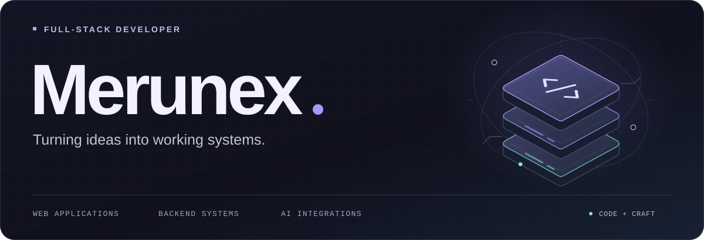
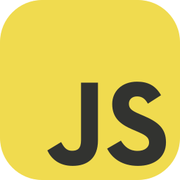

<picture>
  <source media="(max-width: 600px)" srcset="./assets/hero-mobile.svg">
  
</picture>

I build **web applications, Telegram bots, and backend services** — with a focus on clear architecture, thoughtful database design, and practical AI integrations.

  <a href="https://github.com/Merunex?tab=repositories"><b>Explore repositories ↗</b></a>
  &nbsp;&nbsp;·&nbsp;&nbsp;
  <a href="https://github.com/Merunex?tab=stars">What catches my eye ↗</a>

### What I build

<table>
  <tr>
    <td width="50%" valign="top">
      <h3>01 &nbsp; / &nbsp; Web &amp; backend</h3>
      
Database-driven applications and backend services with structured, maintainable logic.

      
<code>PHP</code> <code>JavaScript</code> <code>MySQL</code>

    </td>
    <td width="50%" valign="top">
      <h3>02 &nbsp; / &nbsp; Bots &amp; AI</h3>
      
Telegram bot systems, local LLM integrations, and automation for everyday workflows.

      
<code>Python</code> <code>Telegram</code> <code>Local AI</code>

    </td>
  </tr>
</table>

### Tools of the trade

  &nbsp;
  &nbsp;
  &nbsp;
  &nbsp;
  &nbsp;
  &nbsp;
  &nbsp;
  &nbsp;
  

<b>Languages</b> &nbsp; PHP · Python · JavaScript &nbsp; / &nbsp; <b>Data</b> &nbsp; MySQL &nbsp; / &nbsp; <b>Web</b> &nbsp; HTML · CSS

 

### On my radar

- **AI-powered Telegram bots** that connect conversations to useful actions.
- **Local LLM workflows** integrated into applications and tools.
- **Technical &amp; educational projects** built around clear, practical solutions.

 

<picture>
  <source media="(max-width: 600px)" srcset="./assets/footer-mobile.svg">
  
</picture>
